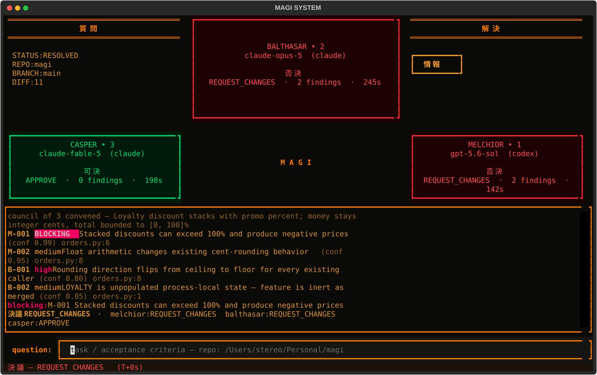

<h1 align="center">M A G I</h1>

<p align="center">
  <em>A deliberation council for code review.</em>
</p>

<p align="center">
  
  
  
</p>

<p align="center">
  
</p>

Three AI members examine your change independently and vote — 可決 / 否決.
MAGI runs on the LLM subscriptions you already pay for; no API keys required.

## Why three reviewers

One model reviewing code produces one generic list of bugs. MAGI forces three
genuinely different reviews:

| Member | Mandate | Central question |
|---|---|---|
| **MELCHIOR·1** | Correctness & evidence | *Show me the execution path on which this fails.* |
| **BALTHASAR·2** | Stewardship & risk | *If this goes wrong at 3 a.m., who pays for it — can they recover?* |
| **CASPER·3** | Intent & design | *Is this the right change, expressed the right way?* |

Each member reviews privately against the same evidence packet, returns
schema-enforced findings — every finding must name a trigger, an observable
failure, and evidence — then the council cross-examines itself and merges the
verdicts under asymmetric rules. Vague review output ("consider refactoring",
"add more tests") is banned by protocol.

The sections below use Simplified Technical English.

---

## The protocol

Each member gets the same evidence packet. The packet contains the task text
and the diff. Each member can read the repository. A member cannot change the
repository. Each first-round review is private.

A member gives one of three verdicts: 可決 (APPROVE), 否決 (REQUEST_CHANGES),
or 保留 (ABSTAIN). A member that fails becomes offline (沈黙). An offline
member counts as an abstention. The council continues with the other members.

### The rebuttal round

The rebuttal round starts when all first reviews are complete. Each member
examines the findings of the other members. The member gives one response for
each finding:

- ACCEPT — the finding is correct and important.
- PARTIALLY_ACCEPT — the defect is correct, but the severity or the scope is not.
- CHALLENGE — the finding is not correct. A challenge must contain evidence.
- OUT_OF_SCOPE — the finding is not in the mandate of the council.

A member can change its verdict after the rebuttal round.

### The merge rules

A finding is *disputed* when all responders challenge it and no responder
accepts it. An omitted response or an OUT_OF_SCOPE response keeps the finding
confirmed. MAGI applies the first rule that matches:

1. A confirmed blocking finding exists → REQUEST_CHANGES. Votes cannot cancel it.
2. A disputed blocking finding exists → HUMAN_REVIEW.
3. Two or more members vote REQUEST_CHANGES → REQUEST_CHANGES.
4. One member votes REQUEST_CHANGES → HUMAN_REVIEW.
5. Two or more members vote APPROVE → APPROVE.
6. No rule matches (too many abstentions) → HUMAN_REVIEW.

## The backends

The members are vendor CLI processes. MAGI starts them in headless mode.

| Backend | Authorization | Isolation |
|---|---|---|
| `claude -p` | Claude subscription | The member context is clean. User settings, hooks, and memory files do not go to the member. The member has only the Read, Grep, and Glob tools. |
| `codex exec` | ChatGPT subscription | The operating system enforces a read-only sandbox. The session is ephemeral. |
| `gemini` | — | This backend is not complete. |

The backends request schema-controlled replies: `--json-schema` (claude) and
`--output-schema` (codex). A reply that does not parse makes the member
abstain or become offline. It cannot corrupt the merge.

The default council is: MELCHIOR uses `gpt-5.6-sol`. BALTHASAR uses
`claude-opus-5`. CASPER uses `claude-fable-5`. The correctness member uses a
different model family than the other two members. The members then are less
likely to make the same error.

---

## Setup

1. Install the `claude` CLI or the `codex` CLI, or both.
2. Run `uv run magi init`.

The command finds the installed CLIs. Then the command writes the council
configuration. Use `--local` to write `./magi.toml` in the current directory.
Use `--force` to replace an old configuration.

The configuration is TOML. Each member has one table:

```toml
[council.melchior]
backend = "codex"        # claude | codex | gemini (not complete)
model = "gpt-5.6-sol"
effort = "xhigh"
```

MAGI reads the configuration in this sequence. A later source has priority.

1. The default values in the code.
2. The global file: `$MAGI_CONFIG` if set, else `$XDG_CONFIG_HOME/magi/config.toml`,
   else `~/.config/magi/config.toml`.
3. The file `magi.toml` in the repository that you review.

Set only the members that you want to change. The other members keep their
default values.

---

## Operation

```sh
uv run magi                       # standby; no review starts
uv run magi /path/to/repo         # standby with a set repository
uv run magi . "task description"  # the council starts immediately
```

Without a task argument, the TUI starts in standby mode. Type the task in the
question field and push the enter key. Then the council starts.

MAGI reviews the difference between the work tree and `HEAD`, plus all
untracked files. Files in `.gitignore` are not included. An untracked file
larger than 100 kB is noted and skipped. When there is no difference and
there are no untracked files, MAGI reviews the last commit.

The TUI shows one panel for each member. A panel is amber during the review.
The panel names the model at its bottom edge. Then the panel color shows the
verdict: green 可決, red 否決, yellow 保留, dark 沈黙. The findings and the
rebuttal positions go to the ticker. The merged verdict goes to the status bar.

The question field is locked while the council deliberates. Push ctrl+c to stop
the council at any stage. MAGI stops the member CLI processes and returns to
standby. Push ctrl+q to quit.

### Plan review

```sh
magi plan DESIGN.md "goals or constraints"
```

MAGI can review a proposal document before the implementation starts. The
members search for gaps, contradictions, unstated assumptions, and risks. A
plan review does not need a git repository. The council cannot approve a
plan; the best possible result is HUMAN_REVIEW. A person approves a plan.

The persona and protocol prompts are markdown files in `src/magi/prompts/`.
Edit them to tune the council.

### Headless mode for CI

```sh
magi . "task" --report    # text report on stdout
magi . "task" --json      # JSON result on stdout
```

MAGI operates in headless mode when stdout is not a terminal. The progress
messages go to stderr as each member completes. The stdout output stays clean
for tools such as `jq`. The exit code shows the verdict:

| Code | Verdict |
|---|---|
| 0 | APPROVE |
| 1 | REQUEST_CHANGES |
| 2 | HUMAN_REVIEW |
| 3 | Error (bad configuration, not a git repository) |

---

## Development

```sh
uv sync
uv run pytest
```

The tests use fake backends. The tests do not make live model calls.

## Roadmap

- Add the gemini backend.
- Add the experiment mode: one git worktree for each member, with a sandbox
  that permits writes.

## License

The license is MIT. Refer to the [LICENSE](LICENSE) file.

MAGI is a fan project. MAGI has no connection with khara, Gainax, or the
Evangelion franchise.
